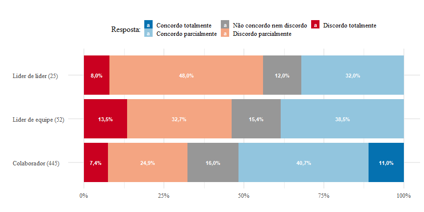
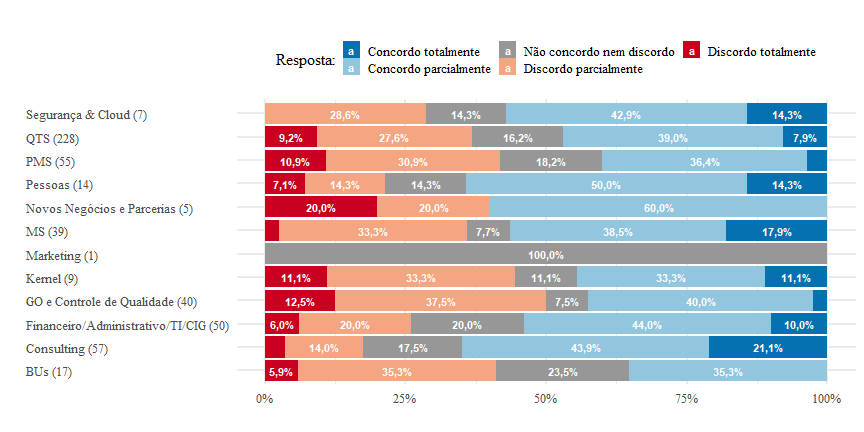
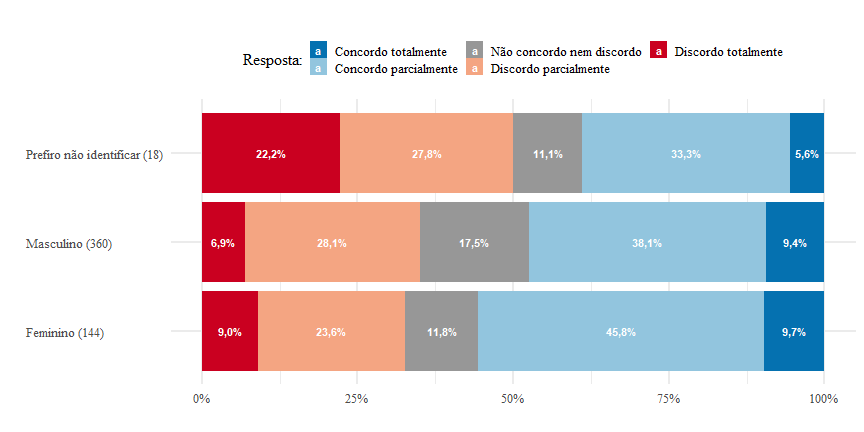
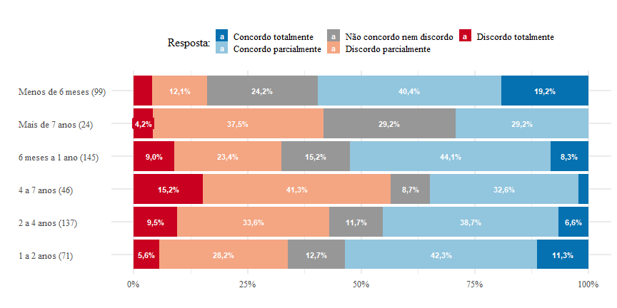
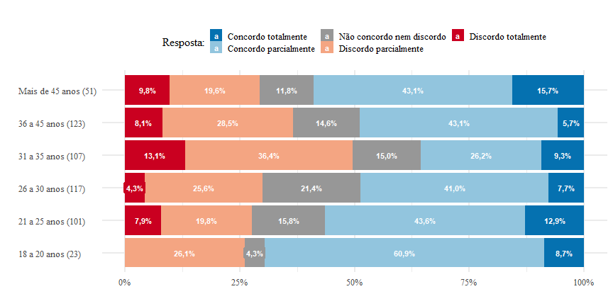
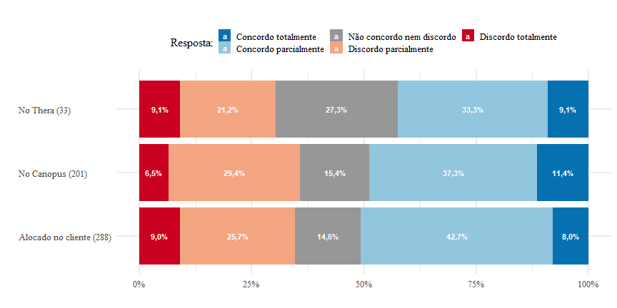

# Questões versus Cortes

## Questão 9

> 9. Os colaboradores são preparados de maneira adequada para atuar com excelência em seus projetos e/ou áreas. [->]

 
### 1. Eu sou:

<table style="border-collapse:collapse; border:none;">
 <tr>
 <th style="border-top:double; text-align:center; font-style:italic; font-weight:normal; border-bottom:1px solid;" rowspan="2">1. Eu sou:</th>
 <th style="border-top:double; text-align:center; font-style:italic; font-weight:normal;" colspan="3">9. Os colaboradores são preparados de maneira adequada para atuar com excelência em seus projetos e/ou áreas. [->]</th>
 <th style="border-top:double; text-align:center; font-style:italic; font-weight:normal; font-weight:bolder; font-style:italic; border-bottom:1px solid; " rowspan="2">Total</th>
 </tr>
 
<tr>
 <td style="border-bottom:1px solid; text-align:center; padding:0.2cm;">Colaborador</td>
 <td style="border-bottom:1px solid; text-align:center; padding:0.2cm;">Líder de equipe</td>
 <td style="border-bottom:1px solid; text-align:center; padding:0.2cm;">Líder de líder</td>
 </tr>
 
<tr> 
<td style="padding:0.2cm;  text-align:left; vertical-align:middle;">Discordo totalmente</td>
<td style="padding:0.2cm; text-align:center; ">33</td>
<td style="padding:0.2cm; text-align:center; ">7</td>
<td style="padding:0.2cm; text-align:center; ">2</td>
<td style="padding:0.2cm; text-align:center;  ">42</td> 
</tr>
 
<tr> 
<td style="padding:0.2cm;  text-align:left; vertical-align:middle;">Discordo parcialmente</td>
<td style="padding:0.2cm; text-align:center; ">111</td>
<td style="padding:0.2cm; text-align:center; ">17</td>
<td style="padding:0.2cm; text-align:center; ">12</td>
<td style="padding:0.2cm; text-align:center;  ">140</td> 
</tr>
 
<tr> 
<td style="padding:0.2cm;  text-align:left; vertical-align:middle;">Não concordo nem discordo</td>
<td style="padding:0.2cm; text-align:center; ">71</td>
<td style="padding:0.2cm; text-align:center; ">8</td>
<td style="padding:0.2cm; text-align:center; ">3</td>
<td style="padding:0.2cm; text-align:center;  ">82</td> 
</tr>
 
<tr> 
<td style="padding:0.2cm;  text-align:left; vertical-align:middle;">Concordo parcialmente</td>
<td style="padding:0.2cm; text-align:center; ">181</td>
<td style="padding:0.2cm; text-align:center; ">20</td>
<td style="padding:0.2cm; text-align:center; ">8</td>
<td style="padding:0.2cm; text-align:center;  ">209</td> 
</tr>
 
<tr> 
<td style="padding:0.2cm;  text-align:left; vertical-align:middle;">Concordo totalmente</td>
<td style="padding:0.2cm; text-align:center; ">49</td>
<td style="padding:0.2cm; text-align:center; ">0</td>
<td style="padding:0.2cm; text-align:center; ">0</td>
<td style="padding:0.2cm; text-align:center;  ">49</td> 
</tr>
 
<tr> 
<td style="padding:0.2cm;  border-bottom:double; font-weight:bolder; font-style:italic; text-align:left; vertical-align:middle;">Total</td>
<td style="padding:0.2cm; text-align:center;   border-bottom:double;">445</td>
<td style="padding:0.2cm; text-align:center;   border-bottom:double;">52</td>
<td style="padding:0.2cm; text-align:center;   border-bottom:double;">25</td>
<td style="padding:0.2cm; text-align:center;   border-bottom:double;">522</td> 
</tr>
 <td style="text-align:right; font-size:0.9em; font-style:italic; padding:0.2cm;" colspan="5">&chi;2=16.748 &middot; df=8 &middot; Cramer's V=0.127 &middot; Fisher's p=0.012</td> 
</tr>
 
</table>

### 2. Área:

<table style="border-collapse:collapse; border:none;">
 <tr>
 <th style="border-top:double; text-align:center; font-style:italic; font-weight:normal; border-bottom:1px solid;" rowspan="2">2. Área:</th>
 <th style="border-top:double; text-align:center; font-style:italic; font-weight:normal;" colspan="12">9. Os colaboradores são preparados de maneira adequada para atuar com excelência em seus projetos e/ou áreas. [->]</th>
 <th style="border-top:double; text-align:center; font-style:italic; font-weight:normal; font-weight:bolder; font-style:italic; border-bottom:1px solid; " rowspan="2">Total</th>
 </tr>
 
<tr>
 <td style="border-bottom:1px solid; text-align:center; padding:0.2cm;">BUs</td>
 <td style="border-bottom:1px solid; text-align:center; padding:0.2cm;">Consulting</td>
 <td style="border-bottom:1px solid; text-align:center; padding:0.2cm;">Financeiro/Administrativo/TI/CIG</td>
 <td style="border-bottom:1px solid; text-align:center; padding:0.2cm;">GO e Controle de Qualidade</td>
 <td style="border-bottom:1px solid; text-align:center; padding:0.2cm;">Kernel</td>
 <td style="border-bottom:1px solid; text-align:center; padding:0.2cm;">Marketing</td>
 <td style="border-bottom:1px solid; text-align:center; padding:0.2cm;">MS</td>
 <td style="border-bottom:1px solid; text-align:center; padding:0.2cm;">Novos Negócios e Parcerias</td>
 <td style="border-bottom:1px solid; text-align:center; padding:0.2cm;">Pessoas</td>
 <td style="border-bottom:1px solid; text-align:center; padding:0.2cm;">PMS</td>
 <td style="border-bottom:1px solid; text-align:center; padding:0.2cm;">QTS</td>
 <td style="border-bottom:1px solid; text-align:center; padding:0.2cm;">Segurança & Cloud</td>
 </tr>
 
<tr> 
<td style="padding:0.2cm;  text-align:left; vertical-align:middle;">Discordo totalmente</td>
<td style="padding:0.2cm; text-align:center; ">1</td>
<td style="padding:0.2cm; text-align:center; ">2</td>
<td style="padding:0.2cm; text-align:center; ">3</td>
<td style="padding:0.2cm; text-align:center; ">5</td>
<td style="padding:0.2cm; text-align:center; ">1</td>
<td style="padding:0.2cm; text-align:center; ">0</td>
<td style="padding:0.2cm; text-align:center; ">1</td>
<td style="padding:0.2cm; text-align:center; ">1</td>
<td style="padding:0.2cm; text-align:center; ">1</td>
<td style="padding:0.2cm; text-align:center; ">6</td>
<td style="padding:0.2cm; text-align:center; ">21</td>
<td style="padding:0.2cm; text-align:center; ">0</td>
<td style="padding:0.2cm; text-align:center;  ">42</td> 
</tr>
 
<tr> 
<td style="padding:0.2cm;  text-align:left; vertical-align:middle;">Discordo parcialmente</td>
<td style="padding:0.2cm; text-align:center; ">6</td>
<td style="padding:0.2cm; text-align:center; ">8</td>
<td style="padding:0.2cm; text-align:center; ">10</td>
<td style="padding:0.2cm; text-align:center; ">15</td>
<td style="padding:0.2cm; text-align:center; ">3</td>
<td style="padding:0.2cm; text-align:center; ">0</td>
<td style="padding:0.2cm; text-align:center; ">13</td>
<td style="padding:0.2cm; text-align:center; ">1</td>
<td style="padding:0.2cm; text-align:center; ">2</td>
<td style="padding:0.2cm; text-align:center; ">17</td>
<td style="padding:0.2cm; text-align:center; ">63</td>
<td style="padding:0.2cm; text-align:center; ">2</td>
<td style="padding:0.2cm; text-align:center;  ">140</td> 
</tr>
 
<tr> 
<td style="padding:0.2cm;  text-align:left; vertical-align:middle;">Não concordo nem discordo</td>
<td style="padding:0.2cm; text-align:center; ">4</td>
<td style="padding:0.2cm; text-align:center; ">10</td>
<td style="padding:0.2cm; text-align:center; ">10</td>
<td style="padding:0.2cm; text-align:center; ">3</td>
<td style="padding:0.2cm; text-align:center; ">1</td>
<td style="padding:0.2cm; text-align:center; ">1</td>
<td style="padding:0.2cm; text-align:center; ">3</td>
<td style="padding:0.2cm; text-align:center; ">0</td>
<td style="padding:0.2cm; text-align:center; ">2</td>
<td style="padding:0.2cm; text-align:center; ">10</td>
<td style="padding:0.2cm; text-align:center; ">37</td>
<td style="padding:0.2cm; text-align:center; ">1</td>
<td style="padding:0.2cm; text-align:center;  ">82</td> 
</tr>
 
<tr> 
<td style="padding:0.2cm;  text-align:left; vertical-align:middle;">Concordo parcialmente</td>
<td style="padding:0.2cm; text-align:center; ">6</td>
<td style="padding:0.2cm; text-align:center; ">25</td>
<td style="padding:0.2cm; text-align:center; ">22</td>
<td style="padding:0.2cm; text-align:center; ">16</td>
<td style="padding:0.2cm; text-align:center; ">3</td>
<td style="padding:0.2cm; text-align:center; ">0</td>
<td style="padding:0.2cm; text-align:center; ">15</td>
<td style="padding:0.2cm; text-align:center; ">3</td>
<td style="padding:0.2cm; text-align:center; ">7</td>
<td style="padding:0.2cm; text-align:center; ">20</td>
<td style="padding:0.2cm; text-align:center; ">89</td>
<td style="padding:0.2cm; text-align:center; ">3</td>
<td style="padding:0.2cm; text-align:center;  ">209</td> 
</tr>
 
<tr> 
<td style="padding:0.2cm;  text-align:left; vertical-align:middle;">Concordo totalmente</td>
<td style="padding:0.2cm; text-align:center; ">0</td>
<td style="padding:0.2cm; text-align:center; ">12</td>
<td style="padding:0.2cm; text-align:center; ">5</td>
<td style="padding:0.2cm; text-align:center; ">1</td>
<td style="padding:0.2cm; text-align:center; ">1</td>
<td style="padding:0.2cm; text-align:center; ">0</td>
<td style="padding:0.2cm; text-align:center; ">7</td>
<td style="padding:0.2cm; text-align:center; ">0</td>
<td style="padding:0.2cm; text-align:center; ">2</td>
<td style="padding:0.2cm; text-align:center; ">2</td>
<td style="padding:0.2cm; text-align:center; ">18</td>
<td style="padding:0.2cm; text-align:center; ">1</td>
<td style="padding:0.2cm; text-align:center;  ">49</td> 
</tr>
 
<tr> 
<td style="padding:0.2cm;  border-bottom:double; font-weight:bolder; font-style:italic; text-align:left; vertical-align:middle;">Total</td>
<td style="padding:0.2cm; text-align:center;   border-bottom:double;">17</td>
<td style="padding:0.2cm; text-align:center;   border-bottom:double;">57</td>
<td style="padding:0.2cm; text-align:center;   border-bottom:double;">50</td>
<td style="padding:0.2cm; text-align:center;   border-bottom:double;">40</td>
<td style="padding:0.2cm; text-align:center;   border-bottom:double;">9</td>
<td style="padding:0.2cm; text-align:center;   border-bottom:double;">1</td>
<td style="padding:0.2cm; text-align:center;   border-bottom:double;">39</td>
<td style="padding:0.2cm; text-align:center;   border-bottom:double;">5</td>
<td style="padding:0.2cm; text-align:center;   border-bottom:double;">14</td>
<td style="padding:0.2cm; text-align:center;   border-bottom:double;">55</td>
<td style="padding:0.2cm; text-align:center;   border-bottom:double;">228</td>
<td style="padding:0.2cm; text-align:center;   border-bottom:double;">7</td>
<td style="padding:0.2cm; text-align:center;   border-bottom:double;">522</td> 
</tr>
 <td style="text-align:right; font-size:0.9em; font-style:italic; padding:0.2cm;" colspan="14">&chi;2=46.765 &middot; df=44 &middot; Cramer's V=0.150 &middot; Fisher's p=0.301</td> 
</tr>
 
</table>

### 3. Gênero:

<table style="border-collapse:collapse; border:none;">
 <tr>
 <th style="border-top:double; text-align:center; font-style:italic; font-weight:normal; border-bottom:1px solid;" rowspan="2">3. Gênero:</th>
 <th style="border-top:double; text-align:center; font-style:italic; font-weight:normal;" colspan="3">9. Os colaboradores são preparados de maneira adequada para atuar com excelência em seus projetos e/ou áreas. [->]</th>
 <th style="border-top:double; text-align:center; font-style:italic; font-weight:normal; font-weight:bolder; font-style:italic; border-bottom:1px solid; " rowspan="2">Total</th>
 </tr>
 
<tr>
 <td style="border-bottom:1px solid; text-align:center; padding:0.2cm;">Feminino</td>
 <td style="border-bottom:1px solid; text-align:center; padding:0.2cm;">Masculino</td>
 <td style="border-bottom:1px solid; text-align:center; padding:0.2cm;">Prefiro não identificar</td>
 </tr>
 
<tr> 
<td style="padding:0.2cm;  text-align:left; vertical-align:middle;">Discordo totalmente</td>
<td style="padding:0.2cm; text-align:center; ">13</td>
<td style="padding:0.2cm; text-align:center; ">25</td>
<td style="padding:0.2cm; text-align:center; ">4</td>
<td style="padding:0.2cm; text-align:center;  ">42</td> 
</tr>
 
<tr> 
<td style="padding:0.2cm;  text-align:left; vertical-align:middle;">Discordo parcialmente</td>
<td style="padding:0.2cm; text-align:center; ">34</td>
<td style="padding:0.2cm; text-align:center; ">101</td>
<td style="padding:0.2cm; text-align:center; ">5</td>
<td style="padding:0.2cm; text-align:center;  ">140</td> 
</tr>
 
<tr> 
<td style="padding:0.2cm;  text-align:left; vertical-align:middle;">Não concordo nem discordo</td>
<td style="padding:0.2cm; text-align:center; ">17</td>
<td style="padding:0.2cm; text-align:center; ">63</td>
<td style="padding:0.2cm; text-align:center; ">2</td>
<td style="padding:0.2cm; text-align:center;  ">82</td> 
</tr>
 
<tr> 
<td style="padding:0.2cm;  text-align:left; vertical-align:middle;">Concordo parcialmente</td>
<td style="padding:0.2cm; text-align:center; ">66</td>
<td style="padding:0.2cm; text-align:center; ">137</td>
<td style="padding:0.2cm; text-align:center; ">6</td>
<td style="padding:0.2cm; text-align:center;  ">209</td> 
</tr>
 
<tr> 
<td style="padding:0.2cm;  text-align:left; vertical-align:middle;">Concordo totalmente</td>
<td style="padding:0.2cm; text-align:center; ">14</td>
<td style="padding:0.2cm; text-align:center; ">34</td>
<td style="padding:0.2cm; text-align:center; ">1</td>
<td style="padding:0.2cm; text-align:center;  ">49</td> 
</tr>
 
<tr> 
<td style="padding:0.2cm;  border-bottom:double; font-weight:bolder; font-style:italic; text-align:left; vertical-align:middle;">Total</td>
<td style="padding:0.2cm; text-align:center;   border-bottom:double;">144</td>
<td style="padding:0.2cm; text-align:center;   border-bottom:double;">360</td>
<td style="padding:0.2cm; text-align:center;   border-bottom:double;">18</td>
<td style="padding:0.2cm; text-align:center;   border-bottom:double;">522</td> 
</tr>
 <td style="text-align:right; font-size:0.9em; font-style:italic; padding:0.2cm;" colspan="5">&chi;2=10.413 &middot; df=8 &middot; Cramer's V=0.100 &middot; Fisher's p=0.305</td> 
</tr>
 
</table>

### 4. Tempo de Empresa (há quanto tempo trabalha na Inmetrics?)

<table style="border-collapse:collapse; border:none;">
 <tr>
 <th style="border-top:double; text-align:center; font-style:italic; font-weight:normal; border-bottom:1px solid;" rowspan="2">4. Tempo de Empresa (há quanto tempo trabalha na Inmetrics?)</th>
 <th style="border-top:double; text-align:center; font-style:italic; font-weight:normal;" colspan="6">9. Os colaboradores são preparados de maneira adequada para atuar com excelência em seus projetos e/ou áreas. [->]</th>
 <th style="border-top:double; text-align:center; font-style:italic; font-weight:normal; font-weight:bolder; font-style:italic; border-bottom:1px solid; " rowspan="2">Total</th>
 </tr>
 
<tr>
 <td style="border-bottom:1px solid; text-align:center; padding:0.2cm;">1 a 2 anos</td>
 <td style="border-bottom:1px solid; text-align:center; padding:0.2cm;">2 a 4 anos</td>
 <td style="border-bottom:1px solid; text-align:center; padding:0.2cm;">4 a 7 anos</td>
 <td style="border-bottom:1px solid; text-align:center; padding:0.2cm;">6 meses a 1 ano</td>
 <td style="border-bottom:1px solid; text-align:center; padding:0.2cm;">Mais de 7 anos</td>
 <td style="border-bottom:1px solid; text-align:center; padding:0.2cm;">Menos de 6 meses</td>
 </tr>
 
<tr> 
<td style="padding:0.2cm;  text-align:left; vertical-align:middle;">Discordo totalmente</td>
<td style="padding:0.2cm; text-align:center; ">4</td>
<td style="padding:0.2cm; text-align:center; ">13</td>
<td style="padding:0.2cm; text-align:center; ">7</td>
<td style="padding:0.2cm; text-align:center; ">13</td>
<td style="padding:0.2cm; text-align:center; ">1</td>
<td style="padding:0.2cm; text-align:center; ">4</td>
<td style="padding:0.2cm; text-align:center;  ">42</td> 
</tr>
 
<tr> 
<td style="padding:0.2cm;  text-align:left; vertical-align:middle;">Discordo parcialmente</td>
<td style="padding:0.2cm; text-align:center; ">20</td>
<td style="padding:0.2cm; text-align:center; ">46</td>
<td style="padding:0.2cm; text-align:center; ">19</td>
<td style="padding:0.2cm; text-align:center; ">34</td>
<td style="padding:0.2cm; text-align:center; ">9</td>
<td style="padding:0.2cm; text-align:center; ">12</td>
<td style="padding:0.2cm; text-align:center;  ">140</td> 
</tr>
 
<tr> 
<td style="padding:0.2cm;  text-align:left; vertical-align:middle;">Não concordo nem discordo</td>
<td style="padding:0.2cm; text-align:center; ">9</td>
<td style="padding:0.2cm; text-align:center; ">16</td>
<td style="padding:0.2cm; text-align:center; ">4</td>
<td style="padding:0.2cm; text-align:center; ">22</td>
<td style="padding:0.2cm; text-align:center; ">7</td>
<td style="padding:0.2cm; text-align:center; ">24</td>
<td style="padding:0.2cm; text-align:center;  ">82</td> 
</tr>
 
<tr> 
<td style="padding:0.2cm;  text-align:left; vertical-align:middle;">Concordo parcialmente</td>
<td style="padding:0.2cm; text-align:center; ">30</td>
<td style="padding:0.2cm; text-align:center; ">53</td>
<td style="padding:0.2cm; text-align:center; ">15</td>
<td style="padding:0.2cm; text-align:center; ">64</td>
<td style="padding:0.2cm; text-align:center; ">7</td>
<td style="padding:0.2cm; text-align:center; ">40</td>
<td style="padding:0.2cm; text-align:center;  ">209</td> 
</tr>
 
<tr> 
<td style="padding:0.2cm;  text-align:left; vertical-align:middle;">Concordo totalmente</td>
<td style="padding:0.2cm; text-align:center; ">8</td>
<td style="padding:0.2cm; text-align:center; ">9</td>
<td style="padding:0.2cm; text-align:center; ">1</td>
<td style="padding:0.2cm; text-align:center; ">12</td>
<td style="padding:0.2cm; text-align:center; ">0</td>
<td style="padding:0.2cm; text-align:center; ">19</td>
<td style="padding:0.2cm; text-align:center;  ">49</td> 
</tr>
 
<tr> 
<td style="padding:0.2cm;  border-bottom:double; font-weight:bolder; font-style:italic; text-align:left; vertical-align:middle;">Total</td>
<td style="padding:0.2cm; text-align:center;   border-bottom:double;">71</td>
<td style="padding:0.2cm; text-align:center;   border-bottom:double;">137</td>
<td style="padding:0.2cm; text-align:center;   border-bottom:double;">46</td>
<td style="padding:0.2cm; text-align:center;   border-bottom:double;">145</td>
<td style="padding:0.2cm; text-align:center;   border-bottom:double;">24</td>
<td style="padding:0.2cm; text-align:center;   border-bottom:double;">99</td>
<td style="padding:0.2cm; text-align:center;   border-bottom:double;">522</td> 
</tr>
 <td style="text-align:right; font-size:0.9em; font-style:italic; padding:0.2cm;" colspan="8">&chi;2=51.291 &middot; df=20 &middot; Cramer's V=0.157 &middot; Fisher's p=0.000</td> 
</tr>
 
</table>

### 5. Faixa etária:

<table style="border-collapse:collapse; border:none;">
 <tr>
 <th style="border-top:double; text-align:center; font-style:italic; font-weight:normal; border-bottom:1px solid;" rowspan="2">5. Faixa etária:</th>
 <th style="border-top:double; text-align:center; font-style:italic; font-weight:normal;" colspan="6">9. Os colaboradores são preparados de maneira adequada para atuar com excelência em seus projetos e/ou áreas. [->]</th>
 <th style="border-top:double; text-align:center; font-style:italic; font-weight:normal; font-weight:bolder; font-style:italic; border-bottom:1px solid; " rowspan="2">Total</th>
 </tr>
 
<tr>
 <td style="border-bottom:1px solid; text-align:center; padding:0.2cm;">18 a 20 anos</td>
 <td style="border-bottom:1px solid; text-align:center; padding:0.2cm;">21 a 25 anos</td>
 <td style="border-bottom:1px solid; text-align:center; padding:0.2cm;">26 a 30 anos</td>
 <td style="border-bottom:1px solid; text-align:center; padding:0.2cm;">31 a 35 anos</td>
 <td style="border-bottom:1px solid; text-align:center; padding:0.2cm;">36 a 45 anos</td>
 <td style="border-bottom:1px solid; text-align:center; padding:0.2cm;">Mais de 45 anos</td>
 </tr>
 
<tr> 
<td style="padding:0.2cm;  text-align:left; vertical-align:middle;">Discordo totalmente</td>
<td style="padding:0.2cm; text-align:center; ">0</td>
<td style="padding:0.2cm; text-align:center; ">8</td>
<td style="padding:0.2cm; text-align:center; ">5</td>
<td style="padding:0.2cm; text-align:center; ">14</td>
<td style="padding:0.2cm; text-align:center; ">10</td>
<td style="padding:0.2cm; text-align:center; ">5</td>
<td style="padding:0.2cm; text-align:center;  ">42</td> 
</tr>
 
<tr> 
<td style="padding:0.2cm;  text-align:left; vertical-align:middle;">Discordo parcialmente</td>
<td style="padding:0.2cm; text-align:center; ">6</td>
<td style="padding:0.2cm; text-align:center; ">20</td>
<td style="padding:0.2cm; text-align:center; ">30</td>
<td style="padding:0.2cm; text-align:center; ">39</td>
<td style="padding:0.2cm; text-align:center; ">35</td>
<td style="padding:0.2cm; text-align:center; ">10</td>
<td style="padding:0.2cm; text-align:center;  ">140</td> 
</tr>
 
<tr> 
<td style="padding:0.2cm;  text-align:left; vertical-align:middle;">Não concordo nem discordo</td>
<td style="padding:0.2cm; text-align:center; ">1</td>
<td style="padding:0.2cm; text-align:center; ">16</td>
<td style="padding:0.2cm; text-align:center; ">25</td>
<td style="padding:0.2cm; text-align:center; ">16</td>
<td style="padding:0.2cm; text-align:center; ">18</td>
<td style="padding:0.2cm; text-align:center; ">6</td>
<td style="padding:0.2cm; text-align:center;  ">82</td> 
</tr>
 
<tr> 
<td style="padding:0.2cm;  text-align:left; vertical-align:middle;">Concordo parcialmente</td>
<td style="padding:0.2cm; text-align:center; ">14</td>
<td style="padding:0.2cm; text-align:center; ">44</td>
<td style="padding:0.2cm; text-align:center; ">48</td>
<td style="padding:0.2cm; text-align:center; ">28</td>
<td style="padding:0.2cm; text-align:center; ">53</td>
<td style="padding:0.2cm; text-align:center; ">22</td>
<td style="padding:0.2cm; text-align:center;  ">209</td> 
</tr>
 
<tr> 
<td style="padding:0.2cm;  text-align:left; vertical-align:middle;">Concordo totalmente</td>
<td style="padding:0.2cm; text-align:center; ">2</td>
<td style="padding:0.2cm; text-align:center; ">13</td>
<td style="padding:0.2cm; text-align:center; ">9</td>
<td style="padding:0.2cm; text-align:center; ">10</td>
<td style="padding:0.2cm; text-align:center; ">7</td>
<td style="padding:0.2cm; text-align:center; ">8</td>
<td style="padding:0.2cm; text-align:center;  ">49</td> 
</tr>
 
<tr> 
<td style="padding:0.2cm;  border-bottom:double; font-weight:bolder; font-style:italic; text-align:left; vertical-align:middle;">Total</td>
<td style="padding:0.2cm; text-align:center;   border-bottom:double;">23</td>
<td style="padding:0.2cm; text-align:center;   border-bottom:double;">101</td>
<td style="padding:0.2cm; text-align:center;   border-bottom:double;">117</td>
<td style="padding:0.2cm; text-align:center;   border-bottom:double;">107</td>
<td style="padding:0.2cm; text-align:center;   border-bottom:double;">123</td>
<td style="padding:0.2cm; text-align:center;   border-bottom:double;">51</td>
<td style="padding:0.2cm; text-align:center;   border-bottom:double;">522</td> 
</tr>
 <td style="text-align:right; font-size:0.9em; font-style:italic; padding:0.2cm;" colspan="8">&chi;2=33.142 &middot; df=20 &middot; Cramer's V=0.126 &middot; Fisher's p=0.034</td> 
</tr>
 
</table>

### 6. Alocação:

<table style="border-collapse:collapse; border:none;">
 <tr>
 <th style="border-top:double; text-align:center; font-style:italic; font-weight:normal; border-bottom:1px solid;" rowspan="2">6. Alocação:</th>
 <th style="border-top:double; text-align:center; font-style:italic; font-weight:normal;" colspan="3">9. Os colaboradores são preparados de maneira adequada para atuar com excelência em seus projetos e/ou áreas. [->]</th>
 <th style="border-top:double; text-align:center; font-style:italic; font-weight:normal; font-weight:bolder; font-style:italic; border-bottom:1px solid; " rowspan="2">Total</th>
 </tr>
 
<tr>
 <td style="border-bottom:1px solid; text-align:center; padding:0.2cm;">Alocado no cliente</td>
 <td style="border-bottom:1px solid; text-align:center; padding:0.2cm;">No Canopus</td>
 <td style="border-bottom:1px solid; text-align:center; padding:0.2cm;">No Thera</td>
 </tr>
 
<tr> 
<td style="padding:0.2cm;  text-align:left; vertical-align:middle;">Discordo totalmente</td>
<td style="padding:0.2cm; text-align:center; ">26</td>
<td style="padding:0.2cm; text-align:center; ">13</td>
<td style="padding:0.2cm; text-align:center; ">3</td>
<td style="padding:0.2cm; text-align:center;  ">42</td> 
</tr>
 
<tr> 
<td style="padding:0.2cm;  text-align:left; vertical-align:middle;">Discordo parcialmente</td>
<td style="padding:0.2cm; text-align:center; ">74</td>
<td style="padding:0.2cm; text-align:center; ">59</td>
<td style="padding:0.2cm; text-align:center; ">7</td>
<td style="padding:0.2cm; text-align:center;  ">140</td> 
</tr>
 
<tr> 
<td style="padding:0.2cm;  text-align:left; vertical-align:middle;">Não concordo nem discordo</td>
<td style="padding:0.2cm; text-align:center; ">42</td>
<td style="padding:0.2cm; text-align:center; ">31</td>
<td style="padding:0.2cm; text-align:center; ">9</td>
<td style="padding:0.2cm; text-align:center;  ">82</td> 
</tr>
 
<tr> 
<td style="padding:0.2cm;  text-align:left; vertical-align:middle;">Concordo parcialmente</td>
<td style="padding:0.2cm; text-align:center; ">123</td>
<td style="padding:0.2cm; text-align:center; ">75</td>
<td style="padding:0.2cm; text-align:center; ">11</td>
<td style="padding:0.2cm; text-align:center;  ">209</td> 
</tr>
 
<tr> 
<td style="padding:0.2cm;  text-align:left; vertical-align:middle;">Concordo totalmente</td>
<td style="padding:0.2cm; text-align:center; ">23</td>
<td style="padding:0.2cm; text-align:center; ">23</td>
<td style="padding:0.2cm; text-align:center; ">3</td>
<td style="padding:0.2cm; text-align:center;  ">49</td> 
</tr>
 
<tr> 
<td style="padding:0.2cm;  border-bottom:double; font-weight:bolder; font-style:italic; text-align:left; vertical-align:middle;">Total</td>
<td style="padding:0.2cm; text-align:center;   border-bottom:double;">288</td>
<td style="padding:0.2cm; text-align:center;   border-bottom:double;">201</td>
<td style="padding:0.2cm; text-align:center;   border-bottom:double;">33</td>
<td style="padding:0.2cm; text-align:center;   border-bottom:double;">522</td> 
</tr>
 <td style="text-align:right; font-size:0.9em; font-style:italic; padding:0.2cm;" colspan="5">&chi;2=7.834 &middot; df=8 &middot; Cramer's V=0.087 &middot; Fisher's p=0.460</td> 
</tr>
 
</table>
